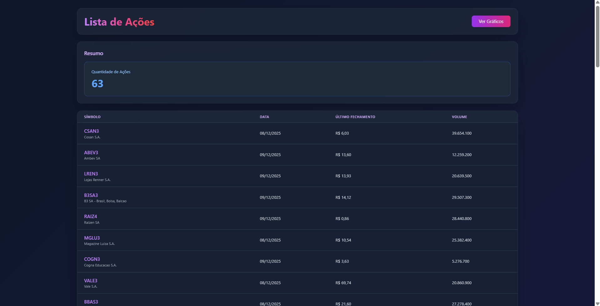
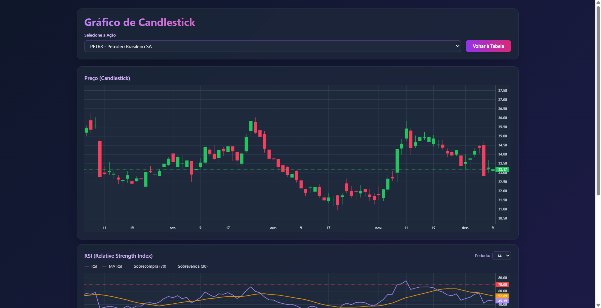

# Easy Trader Analytics

Sistema de análise técnica de ações da B3 (Bolsa de Valores Brasileira) com interface web moderna e visualização de dados em tempo real.

## � Screenshots

### Página de Tabela


### Página de Gráficos


### Detalhes


## �📋 Descrição

Easy Trader Analytics é uma aplicação web desenvolvida em PHP que permite visualizar e analisar dados históricos de ações brasileiras. O sistema coleta dados através da API BrAPI, armazena localmente em formato JSON e apresenta através de gráficos interativos e tabelas dinâmicas.

## ✨ Funcionalidades

- **Visualização de Dados**: Tabela com listagem de todas as ações monitoradas
- **Gráficos Interativos**: Candlestick charts usando Lightweight Charts
- **Cache Inteligente**: Sistema de cache de 10 minutos para otimizar performance
- **Dados em Tempo Real**: Atualização automática dos dados via API
- **Interface Moderna**: Design responsivo com Tailwind CSS e efeitos glassmorphism
- **Múltiplas Ações**: Monitoramento de 63 ações da B3

## 🚀 Tecnologias Utilizadas

- **Backend**: PHP 7.4+
- **Frontend**: 
  - HTML5
  - JavaScript (ES6+)
  - Tailwind CSS
  - Lightweight Charts
- **API**: BrAPI (Brazilian API)
- **Servidor**: Apache (XAMPP)

## 📁 Estrutura do Projeto

```
easy-trader-analytics/
├── api/                    # Endpoints da API
│   ├── prices.php         # API de preços históricos
│   └── stocks.php         # API de listagem de ações
├── cache/                  # Arquivos de cache
│   └── stocks.json        # Cache de dados das ações
├── config/                 # Configurações
│   ├── index.php          # Configurações principais
│   └── index.example.php  # Exemplo de configuração
├── data/                   # Dados históricos das ações
│   └── [SYMBOL]/          # Diretório por ação
│       └── full.json      # Histórico completo
├── database/               # Scripts de banco de dados (legado)
├── routines/               # Scripts de manutenção
│   ├── clear_data.php     # Limpeza de dados
│   └── update_max.php     # Atualização de dados históricos
├── views/                  # Páginas web
│   ├── stock.php          # Página de gráficos
│   └── table.php          # Página de tabela
├── index.php               # Página inicial (redireciona)
└── README.md               # Este arquivo
```

## ⚙️ Instalação

### Pré-requisitos

- XAMPP 7.4+ ou servidor Apache com PHP 7.4+
- Chave de API da BrAPI ([obter aqui](https://brapi.dev))

### Passo a Passo

1. **Clone ou copie o projeto** para o diretório do XAMPP:
   ```bash
   cd C:\xampp\htdocs\
   # Copie a pasta easy-trader-analytics
   ```

2. **Configure as credenciais**:
   - Copie `config/index.example.php` para `config/index.php`
   - Edite `config/index.php` e configure:
     ```php
     define('USERNAME', 'seu_usuario');
     define('PASSWORD', 'sua_senha');
     define('BRAPI_API_KEY', 'sua_chave_api');
     ```

3. **Crie os diretórios necessários**:
   ```bash
   mkdir cache
   mkdir data
   ```

4. **Configure permissões** (se necessário):
   - Garanta que os diretórios `cache` e `data` tenham permissão de escrita

5. **Inicie o XAMPP**:
   - Inicie o Apache
   - Acesse: `http://localhost/easy-trader-analytics`

## 🔄 Atualização de Dados

### Atualização Manual

Execute o script de atualização para buscar dados históricos:

```bash
cd C:\xampp\htdocs\easy-trader-analytics\routines
php update_max.php
```

Este script:
- Busca dados históricos completos de todas as ações
- Remove registros com volume zero
- Salva em arquivos JSON organizados por ação
- Cria arquivo `full.json` com todo o histórico

### Atualização Automática

Configure um agendador de tarefas (Task Scheduler no Windows ou Cron no Linux) para executar o script diariamente:

**Windows (Task Scheduler)**:
```cmd
C:\xampp\php\php.exe C:\xampp\htdocs\easy-trader-analytics\routines\update_max.php
```

**Linux (Crontab)**:
```bash
0 18 * * 1-5 /usr/bin/php /var/www/html/easy-trader-analytics/routines/update_max.php
```

## 📊 Uso

### Página de Tabela

Acesse `http://localhost/easy-trader-analytics/views/table.php`

- **Visualização**: Lista todas as ações com dados atualizados
- **Informações**: Símbolo, Nome, Data, Último Fechamento e Volume
- **Ordenação**: Clique nos cabeçalhos para ordenar
- **Links**: Clique no símbolo para ver o gráfico

### Página de Gráficos

Acesse `http://localhost/easy-trader-analytics/views/stock.php`

- **Seleção de Ação**: Escolha a ação no dropdown
- **Gráfico Candlestick**: Visualização interativa
- **Controles**: Zoom, pan e crosshair
- **Responsivo**: Adapta-se a diferentes tamanhos de tela

## 🔌 API Endpoints

### GET /api/stocks.php

Retorna lista de todas as ações com dados atualizados.

**Response**:
```json
{
  "success": true,
  "stocks": [
    {
      "symbol": "PETR3",
      "name": "Petroleo Brasileiro SA",
      "lastClose": 38.45,
      "lastVolume": 50234000,
      "lastDate": "23/12/2025"
    }
  ],
  "stats": {
    "totalStocks": 63
  }
}
```

**Cache**: 10 minutos
**Headers**: `X-Cache: HIT/MISS`, `X-Cache-Age: <seconds>`

### GET /api/prices.php?symbol=PETR3

Retorna histórico de preços de uma ação específica.

**Parameters**:
- `symbol` (required): Código da ação (ex: PETR3)

**Response**:
```json
{
  "success": true,
  "symbol": "PETR3",
  "prices": [
    {
      "date": 1703289600,
      "open": 38.20,
      "high": 38.50,
      "low": 38.00,
      "close": 38.45,
      "volume": 50234000
    }
  ]
}
```

## 🎨 Personalização

### Adicionar Novas Ações

Edite `config/index.php` e adicione no array `STOCK_SYMBOLS`:

```php
define('STOCK_SYMBOLS', [
    // ... ações existentes ...
    'NOVO3' => 'Nome da Nova Empresa',
]);
```

Depois execute `routines/update_max.php` para buscar os dados.

### Modificar Estilo

O projeto usa Tailwind CSS via CDN. Para personalizar:

1. Edite as classes Tailwind nos arquivos HTML
2. Modifique os estilos custom na tag `<style>` de cada view
3. Ajuste cores no gradiente principal em `body`

### Alterar Cache

Modifique o tempo de cache em `api/stocks.php`:

```php
$cacheTime = 600; // Tempo em segundos (padrão: 10 minutos)
```

## 🔒 Segurança

- **API Key**: Credenciais armazenadas em arquivo de configuração fora do repositório
- **Headers de Segurança**: Configure CORS e outras políticas conforme necessário
- **Validação**: Sempre valide dados de entrada nas APIs

## 🐛 Troubleshooting

### Erro: "Erro ao carregar dados"

- Verifique se a API key está configurada corretamente
- Confirme que há dados em `data/[SYMBOL]/full.json`
- Execute `routines/update_max.php` para popular os dados

### Cache não funciona

- Verifique permissões de escrita no diretório `cache/`
- Limpe o cache manualmente deletando `cache/stocks.json`

### Gráfico não aparece

- Verifique o console do navegador (F12) para erros JavaScript
- Confirme que os dados estão no formato correto
- Teste o endpoint diretamente: `http://localhost/easy-trader-analytics/api/prices.php?symbol=PETR3`

### Símbolos não aparecem

- Execute `routines/update_max.php` novamente
- Verifique se há limite de requisições na API BrAPI
- Confirme que os símbolos estão corretos em `config/index.php`

## 📝 Ações Monitoradas

O sistema monitora 63 ações da B3, incluindo:

- **Financeiro**: BBAS3, BBDC3, BBSE3, PSSA3
- **Energia**: PETR3, VALE3, CSAN3, ENEV3, EQTL3
- **Varejo**: MGLU3, LREN3, ASAI3, PCAR3, VIVA3
- **Tecnologia**: TOTS3, B3SA3
- **E muitas outras...**

Veja a lista completa em `config/index.php`.

## 📄 Licença

Este projeto é de uso pessoal e educacional.

## 👤 Autor

Ricardo LG

## 🔗 Links Úteis

- [BrAPI Documentation](https://brapi.dev/docs)
- [Lightweight Charts](https://tradingview.github.io/lightweight-charts/)
- [Tailwind CSS](https://tailwindcss.com/)
- [B3 - Bolsa de Valores](https://www.b3.com.br/)

## 📈 Roadmap

- [ ] Adicionar mais indicadores técnicos
- [ ] Implementar alertas de preço
- [ ] Criar dashboard com múltiplos gráficos
- [ ] Adicionar comparação entre ações
- [ ] Implementar exportação de dados (CSV/Excel)
- [ ] Adicionar modo dark/light
- [ ] Criar aplicativo mobile

## 🤝 Contribuição

Sugestões e melhorias são bem-vindas! Abra uma issue ou envie um pull request.

---

**Desenvolvido com ❤️ para traders e investidores brasileiros**
